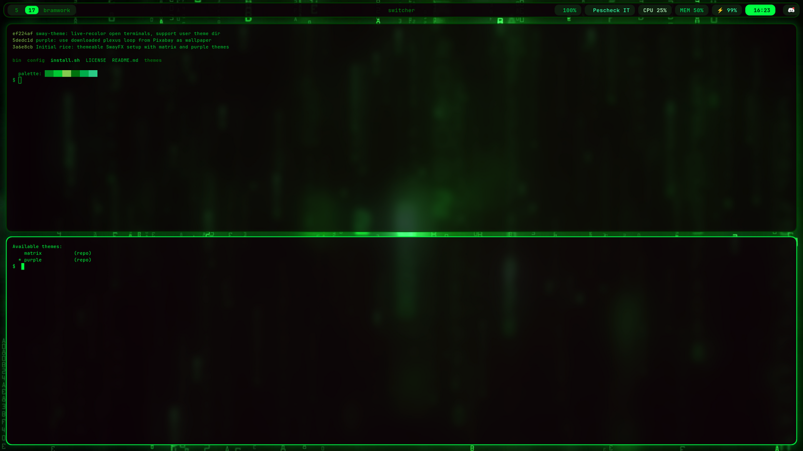
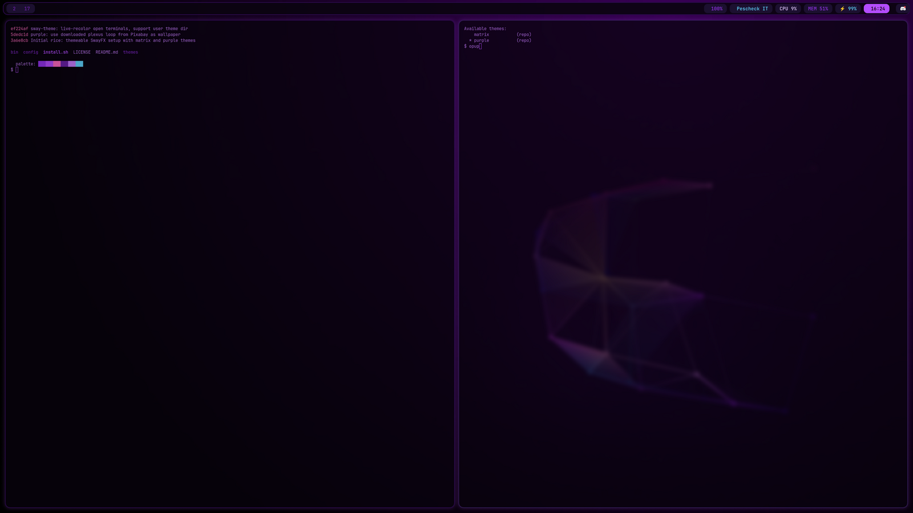

# sway-themes

[](https://github.com/BetterInc/sway-themes/actions/workflows/ci.yml)

My SwayFX rice with switchable themes (Matrix green, neon purple, ...). CI
installs the full rice (including the SwayFX source build) on Debian 12,
Ubuntu 24.04, Arch and Fedora, then boots it headless and screenshots it.

| matrix | purple |
|---|---|
|  |  |

Structure and colors are separated: `config/` holds the theme-agnostic configs
for sway, waybar, foot, rofi and the wallpaper scripts; each directory under
`themes/` is a self-contained color + wallpaper pack. A single symlink
(`~/.config/sway-themes/current`) selects the active theme, and every app
config pulls its colors through it.

```
├── bin/sway-theme          # theme switcher CLI
├── install.sh              # apt deps + symlinks ~/.config into this repo
├── config/
│   ├── sway/               # sway config + scripts (wallpaper-power, inactive-opacity)
│   ├── waybar/             # bar config, structural style.css (@import colors.css)
│   ├── foot/               # terminal structure (includes ~/.config/foot/theme.ini)
│   └── rofi/               # launcher config (@theme "theme")
└── themes/
    ├── matrix/             # green rain
    │   ├── sway-colors.conf     # window borders + swayfx shadow tint
    │   ├── waybar-colors.css    # @define-color palette
    │   ├── foot-colors.ini      # terminal 16 colors, cursor, alpha
    │   ├── rofi.rasi            # launcher theme
    │   ├── swaylock.config      # lock screen colors/effects
    │   ├── wallpaper.mp4        # animated (mpvpaper, on AC) — NOT committed, see below
    │   └── wallpaper-still.png  # static (swaybg, used on battery)
    └── purple/             # same files, violet palette
```

## Requirements

Debian/Ubuntu-ish system on Wayland. Two kinds of dependencies, and
`install.sh` handles both (it runs `build-from-source.sh` for anything the
repos don't have):

**From apt** (runtime):

```sh
sudo apt install waybar foot rofi swaybg swayidle dunst ffmpeg fonts-font-awesome
```

**Built from source** into `~/.local` by `./build-from-source.sh` (which
apt-installs its own build dependencies — meson, ninja, wlroots/wayland dev
headers — see the `BUILD_DEPS` list inside):

| component | role | note |
|---|---|---|
| [SwayFX](https://github.com/WillPower3309/swayfx) 0.3.2 | compositor | **required** — the whole look depends on rounded corners, blur and shadows. Built against a statically-linked wlroots 0.16.2 (Debian 12 ships 0.15, too old). |
| [swaylock-effects](https://github.com/jirutka/swaylock-effects) | lock screen (blurred screenshot + clock) | required for the themed lock |
| [mpvpaper](https://github.com/GhostNaN/mpvpaper) | animated wallpaper | optional — themes fall back to the still image |

**Font**: [JetBrainsMono Nerd Font](https://github.com/ryanoasis/nerd-fonts) —
unzip into `~/.local/share/fonts`, run `fc-cache -f`.

## Install

### Via APT (Debian 12 / Ubuntu 24.04, amd64) — recommended

Pre-built packages, including a compiled SwayFX (no source build needed),
from our [APT repository](https://betterinc.github.io/sway-themes/):

```sh
sudo install -d /etc/apt/keyrings
curl -fsSL https://betterinc.github.io/sway-themes/apt/public.key | \
  sudo gpg --dearmor -o /etc/apt/keyrings/sway-themes.gpg

echo "deb [arch=amd64 signed-by=/etc/apt/keyrings/sway-themes.gpg] https://betterinc.github.io/sway-themes/apt stable main" | \
  sudo tee /etc/apt/sources.list.d/sway-themes.list

sudo apt update
sudo apt install sway-themes swayfx swaylock-effects mpvpaper

sway-themes-setup     # per-user activation (symlinks into ~/.config, backups kept)
```

The same `.deb` files are attached to every
[GitHub release](https://github.com/BetterInc/sway-themes/releases) if you
prefer `apt install ./file.deb`. Note: `swayfx` replaces the stock `sway`
package (it ships `/usr/bin/sway`), and `swaylock-effects` replaces `swaylock`.

### From source (any distro)

```sh
git clone https://github.com/BetterInc/sway-themes ~/sway-themes
~/sway-themes/install.sh
```

The installer apt-installs waybar/foot/rofi/swaybg/swayidle, backs up any
existing configs to `*.bak`, symlinks everything into `~/.config`, and
activates the matrix theme. Custom-built components (swayfx, swaylock-effects,
mpvpaper, JetBrainsMono Nerd Font) are checked and reported with build notes —
see the comments in `install.sh`.

**What it does and doesn't touch**: only symlinks under `~/.config` (sway,
waybar, foot, rofi, swaylock, dunst) and `~/.local/bin/sway-theme` — never
system files or binaries. Your existing configs (including your sway
keybindings) are replaced by this rice, but every original is kept as `*.bak`.
`./uninstall.sh` removes the symlinks and restores the backups.

## Switch themes

```sh
sway-theme            # list themes, * marks the active one
sway-theme purple     # switch: updates the symlink, restarts wallpaper, reloads sway
```

Everything applies live, no re-login needed: waybar, window borders, wallpaper,
rofi and swaylock update immediately — and already-open foot terminals are
recolored in place too (the switcher pushes the palette as OSC 4/10/11/12
escape sequences to every PTY, pywal-style). A re-login is only ever needed
when the compositor binary itself changes (installing or upgrading swayfx) —
never for theme switches or config changes.

## Add your own theme (no fork needed)

`sway-theme` looks for themes in two places, so you can make your own without
touching this repo:

```
~/.config/sway-themes/themes/<name>    your themes (wins on name conflict)
<repo>/themes/<name>                   themes shipped with the repo
```

Start from an existing theme and recolor:

```sh
mkdir -p ~/.config/sway-themes/themes
cp -r ~/sway-themes/themes/matrix ~/.config/sway-themes/themes/mytheme
$EDITOR ~/.config/sway-themes/themes/mytheme/*
sway-theme mytheme
```

A theme is just a directory with these files (all optional except the colors
you actually use): `sway-colors.conf`, `waybar-colors.css`, `foot-colors.ini`,
`rofi.rasi`, `swaylock.config`, `dunstrc` (notifications), `wallpaper.mp4`,
`wallpaper-still.png`.
Themes you want to share can be PR'd into `themes/` here.

A theme without `wallpaper.mp4` falls back to the still image at all times.
Tip: recolor the matrix wallpapers with ffmpeg's hue filter, e.g.
`ffmpeg -i themes/matrix/wallpaper.mp4 -vf hue=h=200 -an out.mp4` for blue.

## Wallpapers

The animated `wallpaper.mp4` files are **not committed** (15–33 MB each).
Download them free from Pixabay (Pixabay Content License, no attribution
required) and drop them into the theme directory:

| theme | video | save as |
|---|---|---|
| matrix | [green digital rain (HD)](https://pixabay.com/videos/matrix-digits-numbers-letters-49470/) | `themes/matrix/wallpaper.mp4` |
| purple | [dark plexus constellation (4K)](https://pixabay.com/videos/plexus-abstract-background-colorful-57860/) | `themes/purple/wallpaper.mp4` |

Any loop you like works — each theme's `WALLPAPER-SOURCE.txt` has details.
Without a video, the theme just uses its committed still image full-time.

`config/sway/scripts/wallpaper-power.sh` plays the animated wallpaper via
mpvpaper on AC power and swaps to the static PNG via swaybg on battery
(checked every 5s from waybar's battery module).
